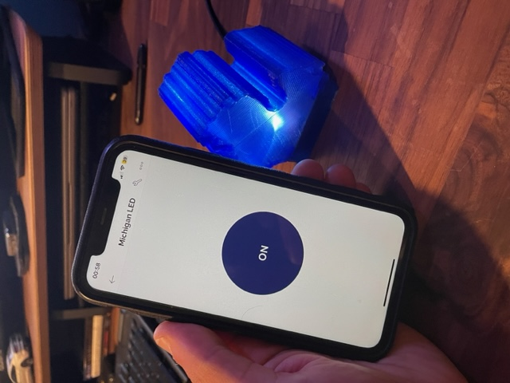

# Michigan Shaped Connected LED
## Description
This is a project to create a connected LED,
controlled via the Blynk IoT app and a [NodeMCU ESP 8266](https://en.wikipedia.org/wiki/NodeMCU) chip.  
In my project, I have placed this apparatus inside a 3D printed case shaped like the Michigan "mitt" for which I am including the .stp files. The case is approximately 2.25"/7cm wide x 3-3/8"/8.5cm tall x 2-1/8"/54mm deep.

## Hardware
⚠️ **Some soldering is necessary** ⚠️  
  
This project requires:
- [NodeMCU ESP8266 chip](https://www.amazon.com/gp/product/B010N1SPRK/ref=ppx_yo_dt_b_search_asin_title?ie=UTF8&psc=1),
- 3 LEDs of any colour,
- 3 330Ω resistors (one for each LED),
- A PCB. All details for the PCB are in the `PCB` folder. All parts are listed in the `hardware/PCB/BOM_NodeMCU_PCB` and can be ordered (including the PCB) via the [EasyEDA website](https://easyeda.com/) which was used to design this project,
- 4 M2-0.4 x 6 screws to close the case (Ref. 91420A003),
- A USB cable to power the device. The NodeMCU chip uses a micro USB-B port.

## How to run
First, install the [Arduino IDE software](https://www.arduino.cc/en/software) which is necessary to load .ino files onto your board.
You will then need to install the Arduino core for ESP8266 which can be found [here](https://github.com/esp8266/Arduino).

You will then need to create an account on [Blynk IoT](https://blynk.io/) and follow the instructions below:

1. Create a new template,
2. Select Hardware `ESP 8266` and Connection Type `WiFi`,
3. Select `Set Up Datastream` and select `Virtual Pin`,
4. In your Virtual Pin Datastream, select PIN `V0` and Data Type `Integer`. Everything else can remain as is.
5. Click `Create`,
6. Go to your web dashboard and add a switch to your dashboard,
7. Click on the switch settings and add the datastream you just created,
8. Go back to `Home` and select `Add first Device`,
9. When you create a new device, a `BLYNK_AUTH_TOKEN` is immediately generated,
10. Copy the token and paste it in the `char auth[] = "";` section of the `led/led.ino` file.

You are now ready to load the `led/led.ino` file onto your NodeMCU ESP8266 chip.

Once the software has compiled and is loaded, you will be ready to use the Blynk IoT app or web dashboard to control your LED.

## Avenues of improvement
- Add a `blinking` mode,
- More luminous LEDs.

## Author
Jérôme Launay